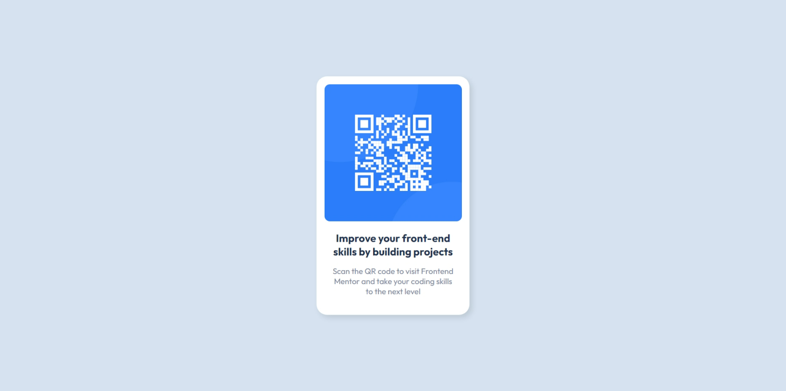

# Frontend Mentor - QR code component solution

This is a solution to the [QR code component challenge on Frontend Mentor](https://www.frontendmentor.io/challenges/qr-code-component-iux_sIO_H). Frontend Mentor challenges help you improve your coding skills by building realistic projects.

## Table of contents

- [Screenshot](#screenshot)

- [My process](#my-process)
  - [Built with](#built-with)
  - [What I learned](#what-i-learned)
  - [Continued development](#continued-development)
- [Author](#author)

### Screenshot



## My process

First of all i added the basic html tags required for the design.
I added two div tags to the template provided and named their class.
Then I added the qr image and a heading tag and a paragraph tag.

After this, I moved to styling for which i created an external style.css file
and began styling.

With the reference of desktop-design image, i tried to produce the
same result as far as i could see.

### Built with

- Semantic HTML5 markup
- CSS custom properties

### What I learned

this box shadow property was a little confusing. But i have learned it now. first value is horizontal offset and
second value is vertical offset. Other optional value are blur and spread and also color.

```css
box-shadow: 5px 5px 10px rgba(0, 0, 0, 0.1);
```

### Continued development

I need to learn box shadows property in detail.
And also optimize a lot of my css stylings.

## Author

- Frontend Mentor - [@luminous42](https://www.frontendmentor.io/profile/luminous42)
